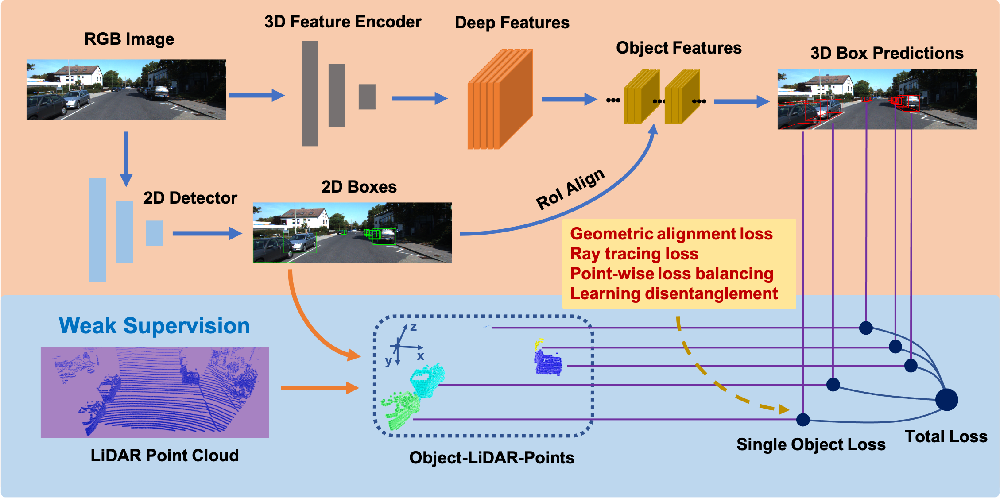

# WeakM3D

<p align="center">  </p>


## Introduction

This is the PyTorch implementation of the paper WeakM3D: Towards Weakly Supervised Monocular 3D Object Detection, In ICLR'22, Liang Peng, Senbo Yan, Boxi Wu, Zheng Yang, Xiaofei He, and Deng Cai.

[[paper]](https://arxiv.org/abs/2203.08332) 

## Abstract
Monocular 3D object detection is one of the most challenging tasks in 3D scene understanding. Due to the ill-posed nature of monocular imagery, existing monocular 3D detection methods highly rely on training with the manually annotated 3D box labels on the LiDAR point clouds.
This annotation process is very laborious and expensive. 
To dispense with the reliance on 3D box labels, in this paper we explore the weakly supervised monocular 3D detection.
Specifically, we first detect 2D boxes on the image. 
Then, we adopt the generated 2D boxes to select corresponding RoI LiDAR points as the weak supervision. 
Eventually, we adopt a network to predict 3D boxes which can tightly align with associated RoI LiDAR points.
This network is learned by minimizing our newly-proposed 3D alignment loss between the 3D box estimates and the corresponding RoI LiDAR points. 
We will illustrate the potential challenges of the above learning problem and resolve these challenges by introducing several effective designs into our method.

## Overview
- [Installation](#installation)
- [Getting Started](#getting-started)
- [Pretrained Model](#pretrained-model)
- [Citation](#citation)


## Installation


### Installation Steps

a. Clone this repository.
```shell
git clone https://github.com/SPengLiang/WeakM3D
```

b. Install the dependent libraries as follows:

* Install the dependent python libraries: 
```shell
pip install torch==1.1.0 torchvision==0.3.0 loguru sklearn opencv tqdm
```
* You can create a conda environment or use docker.


## Getting Started

### Dataset Preparation

Currently we provide the dataloader of KITTI dataset.
You can download the entire [raw KITTI dataset](http://www.cvlibs.net/datasets/kitti/raw_data.php) by running:
```shell
wget -i ./data/kitti/data_file/kitti_archives_to_download.txt -P kitti_data/
```
Then unzip with
```shell
cd kitti_data
unzip "*.zip"
cd ..
ln -s kitti_data ./data/kitti/raw_data
```
**Warning:** it weighs about **175GB**, so make sure you have enough space to unzip.

* Please download the official [KITTI 3D object detection](http://www.cvlibs.net/datasets/kitti/eval_object.php?obj_benchmark=3d) dataset and organize the downloaded files as follows:

```
WeakM3D_PATH
├── data
│   ├── kitti
│   │   │── raw_data
│   │   │── KITTI3D
|   │   │   │── training
|   │   │   │   ├──calib & velodyne & label_2 & image_2 & rgb_detections
|   │   │   │── testing
|   │   │   │   ├──calib & velodyne & image_2
├── config
├── ...
```
The raw_data refers to the soft link to the raw KITTI dataset and the 2D rgb_detections are offline 2D box predictions, generated from [F-PointNet](https://github.com/charlesq34/frustum-pointnets).
Here we provide them at: [Google Drive](https://drive.google.com/file/d/1mmnBzrz5-rLXpX9s7zdba69qSnVplC33/view?usp=sharing).


* You can also choose to link your KITTI dataset path by
```
KITTI_DATA_PATH=~/data/kitti_object
ln -s $KITTI_DATA_PATH/training/ ./data/kitti/KITTI3D/
ln -s $KITTI_DATA_PATH/testing/ ./data/kitti/KITTI3D/
```

* Prepare KITTI raw dataset split for training: 
```python 
python utils/prepare_kitti_raw_datafile.py
```

* Generate the LiDAR RoI points by running the following command, which will take a while: 
```python 
python utils/seg_img.py
python utils/save_lidar_RoI_points.py
```

* To ease the usage, we provide the pre-generated files at: [Google Drive](https://drive.google.com/file/d/1xzuAqty5GEiQSqBS5hpVm3LRl0tTNkT8/view?usp=sharing) 


### Training & Testing


#### Test and evaluate the pretrained models

```shell script
CUDA_VISIBLE_DEVICES=0 python scripts/eval_infer.py --config ./config/resnet34_eval.yaml   
```


#### Train a model  

```shell script
CUDA_VISIBLE_DEVICES=0 python scripts/train.py --config ./config/resnet34_backbone.yaml   
```

## Pretrained Model

To ease the usage, we provide the pre-trained model at: [Google Drive](https://drive.google.com/file/d/1N7rHlj71zrG9rwouDd7MgAFlAGD0Dhnd/view?usp=sharing)

Here we give the comparison.

under AP11 metrics:
<table align="center">
    <tr>
        <td rowspan="2",div align="center">Models</td>
        <td rowspan="2",div align="center">Backbone</td>
        <td colspan="3",div align="center">Car@BEV IoU=0.7</td>    
        <td colspan="3",div align="center">Car@3D IoU=0.7</td>  
    </tr>
    <tr>
        <td div align="center">Easy</td> 
        <td div align="center">Mod</td> 
        <td div align="center">Hard</td> 
        <td div align="center">Easy</td> 
        <td div align="center">Mod</td> 
        <td div align="center">Hard</td>  
    </tr>
    <tr>
        <td div align="center">original paper</td>
        <td div align="center">ResNet50</td>
        <td div align="center">24.89</td> 
        <td div align="center">16.47</td> 
        <td div align="center">14.09</td> 
        <td div align="center">17.06</td> 
        <td div align="center">11.63</td> 
        <td div align="center">11.17</td> 
    </tr>    
    <tr>
        <td div align="center">this repo</td>
        <td div align="center">ResNet34</td>
        <td div align="center">26.92</td> 
        <td div align="center">18.57</td> 
        <td div align="center">15.86</td> 
        <td div align="center">18.27</td> 
        <td div align="center">12.95</td> 
        <td div align="center">11.55</td> 
    </tr>
</table>


under AP40 metrics:
<table align="center">
    <tr>
        <td rowspan="2",div align="center">Models</td>
        <td rowspan="2",div align="center">Backbone</td>
        <td colspan="3",div align="center">Car@BEV IoU=0.5</td>    
        <td colspan="3",div align="center">Car@3D IoU=0.5</td>  
    </tr>
    <tr>
        <td div align="center">Easy</td> 
        <td div align="center">Mod</td> 
        <td div align="center">Hard</td> 
        <td div align="center">Easy</td> 
        <td div align="center">Mod</td> 
        <td div align="center">Hard</td>  
    </tr>
    <tr>
        <td div align="center">original paper</td>
        <td div align="center">ResNet50</td>
        <td div align="center">58.20</td> 
        <td div align="center">38.02</td> 
        <td div align="center">30.17</td> 
        <td div align="center">50.16</td> 
        <td div align="center">29.94</td> 
        <td div align="center">23.11</td> 
    </tr>    
    <tr>
        <td div align="center">this repo</td>
        <td div align="center">ResNet34</td>
        <td div align="center">60.72</td> 
        <td div align="center">40.32</td> 
        <td div align="center">31.34</td> 
        <td div align="center">53.28</td> 
        <td div align="center">33.30</td> 
        <td div align="center">25.76</td> 
    </tr>
</table>


## Citation

```
@inproceedings{peng2021weakm3d,
  title={WeakM3D: Towards Weakly Supervised Monocular 3D Object Detection},
  author={Peng, Liang and Yan, Senbo and Wu, Boxi and Yang, Zheng and He, Xiaofei and Cai, Deng},
  booktitle={International Conference on Learning Representations},
  year={2022}
}
```

## Acknowledgements
The code benefits from  [Monodepth2](https://github.com/nianticlabs/monodepth2), [F-PointNet](https://github.com/charlesq34/frustum-pointnets) and [Second](https://github.com/traveller59/second.pytorch).
